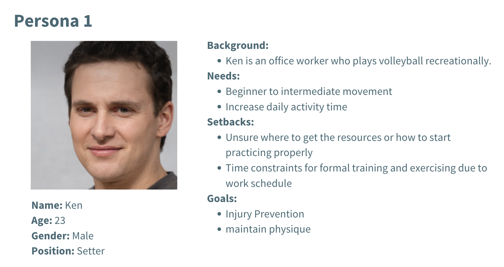
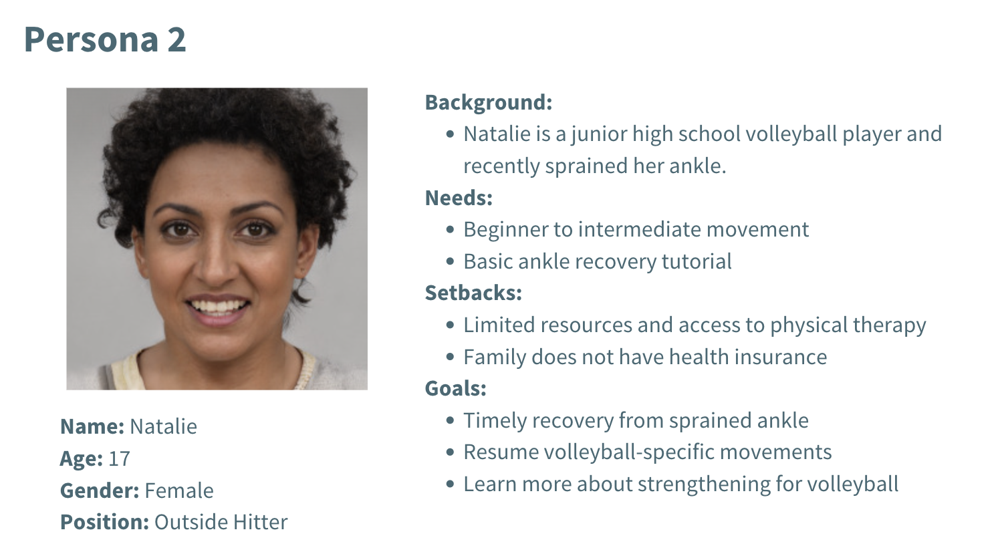

# Healthletes

### Team Sunrise

Caleb Jeyyken, Junna Cao, Sabrina Jahed, Nathan Lee, Gracie Di

## Published Site

Link to our published web app: 

## Mission

Our project aims to address the United Nations Sustainable Development Goal 3: Good Health and Wellbeing, with a specific focus on volleyball athletes who are underprivileged or recreational players. Volleyball, a popular sport enjoyed by many, often requires players to independently acquire knowledge about maintaining their physical health to optimize performance. This includes understanding injury prevention, mobility, and strengthening exercises. Currently, resources like physical therapy or rehabilitation clinics are available to address these needs, but they can be costly and inaccessible to all players. Additionally, while there is a wealth of information available online, much of it is not specific to volleyball and can be overwhelming, particularly for younger or novice athletes. Healthletes aims to bridge this knowledge gap by providing a free, tailored resource for all volleyball players, so that they can confidently step onto the court and perform their best. It is important to note that Healthletes is intended to be supplementary and should not be considered professional medical advice.

## Features

1. **Quiz:** Determines which areas of the body the player should focus on based on their background and current information.
2. **Interactive Diagram:** Educational anatomy diagram with clickable body parts linking to relevant resources.
3. **Resources:** Videos and written instructions for exercises that target key areas of the body for volleyball players. 
4. **Navigation Bar:** Located at the top for quick navigation through the quiz, diagram, and resources. 
5. **About Page:** Information regarding the purpose and origins of Healthletes.

## User Personas

## Development

Built with:
- Javascript
- React
- HTML
- CSS
- Firebase
- Tailwind

## Testing Protocol

Testing protocol can be found [here](/Healthletes%20Testing%20Protocol.pdf)

## Bugs

## References